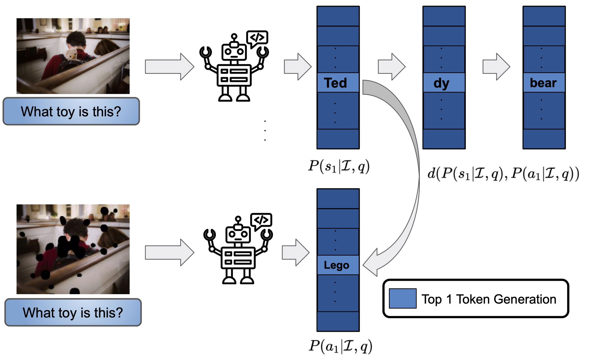

# Detecting Unreliable Responses in Generative Vision-Language Models via Visual Uncertainty
This repository will hold the official code of Visual Uncertainty framework introduced in our ICLR 2025 workshop paper "Detecting Unreliable Responses in Generative Vision-Language Models via Visual Uncertainty".
<div align="center">
  
</div>


🛠 Environment Setup

Set up a new enviornment with python version 3.11, and install the following packages

```pip install -r requirements.txt    ```


## Notebook for Generation and Evaluation Scripts

📝 Generation

To run the generation script for LLaVA-7B or LLaVA-13B:

1. Update the dataset path folders in notebooks/gen_llava7b_aokvqa.ipynb.

2. Set OpenAI API keys in notebooks/utils/LAVE/openai_config_glamor.yaml.

📊 Evaluation

To run the Uncertainty Estimation (UE) baselines on the generated responses:

1. Update the generated filename in notebooks/eval_llava7b_aokvqa.ipynb.

2. Execute the evaluation script notebooks/eval_llava7b_aokvqa.ipynb to obtain AUROC and PRC scores of various UE baselines.


